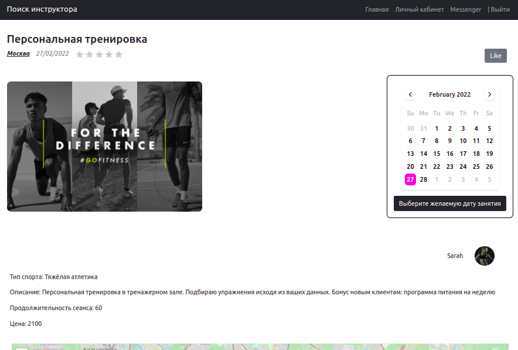
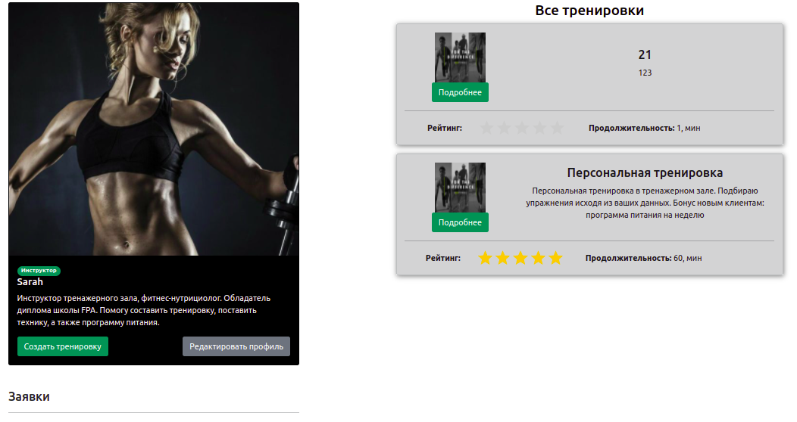
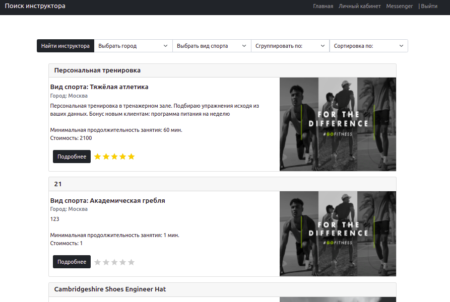
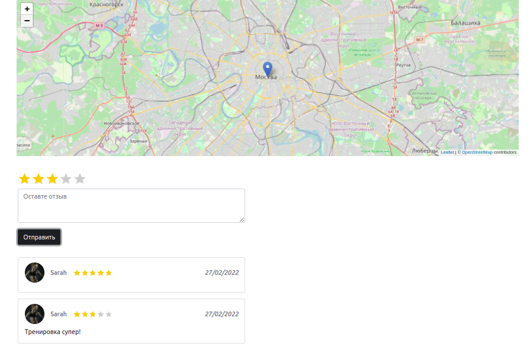

# Find-Instructor
Инструктор по любому виду спорта по всей России

## Cтек:

+ **Фронтенд:** TypeScript, React, Redux(thunk), Axios, Bootstrap
+ **Бэкенд:** TypeScript, Node.js, Express, Sessions, PostgreSQL, Prizma

***

***
В личном кабинете можно создать свою тренировку и принимать заявки от других пользователей

***
Поиск инструктора 

***
Отзывы

